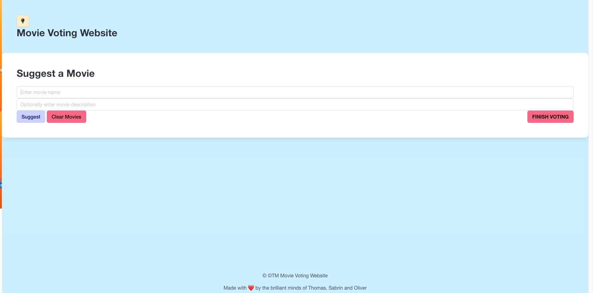
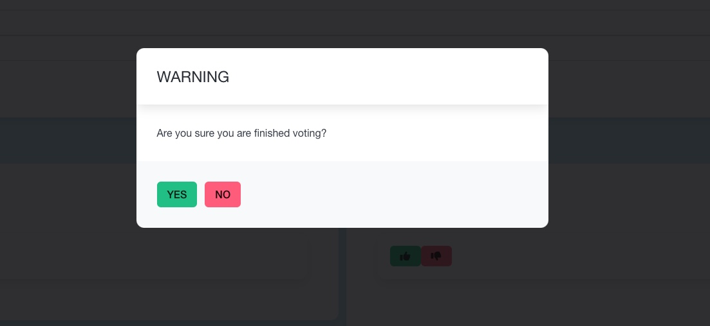
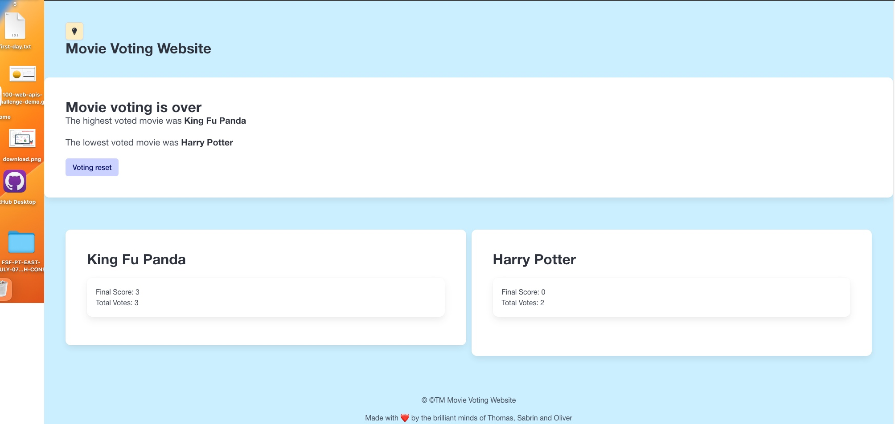

# Movie Voting Website

## Description 
- Have you ever been at a movie night with friends where you ended up leaving and not watching a movie because your friends couldnt agree on a movie?
- Our movie voting app is a fun tool to use with friends and family. Our app takes everyones choice into consideration while also using metrics to decide between for example: Barbie the movie or Captain America.
- Our interactive website allows the user to suggest a movie, vote on a movie and tally up the votes.

## Usage
First the user invites other users to suggest a movie.
Then the users vote on the suggested movies this could be any number suggestion.
The user is then able to see the results of the voting poll.

here is what this looks like.

)

## Credits 🏆 
 - Oliver Bauvil: https://github.com/Olivebolt

 - Thomas Stemler: https://github.com/OccultParrot

 - Sabrin Othman: https://github.com/sabrinothman6495?tab=repositories

## Liscence 
[LICENSE.md](https://github.com/OccultParrot/movie-suggestion-voting/blob/main/LICENSE)

## Features

Site has dark and light mode feature. 
